🛠️ Projeto DevSecOps – Infraestrutura Manual AWS

Este pr

ecOps – Infraestrutura Manual AWS

Este repositório documenta, passo a passo via console AWS, a criação de:

1. VPC + sub-redes (públicas e privadas)  
2. Internet Gateway + Route Tables  
3. Instância EC2 com NGINX  

Com foco em redes, tags, segurança e boas práticas de documentação.

---

## Etapa 1: Criação da VPC

A VPC foi criada em **VPC only** para controlar manualmente todos os componentes da rede.

- **CIDR IPv4:** `10.0.0.0/24`  
- **CIDR IPv6:** Não utilizado  
- **Tenancy:** Default  
- **Tag:** `Name = devsecops-vpc`

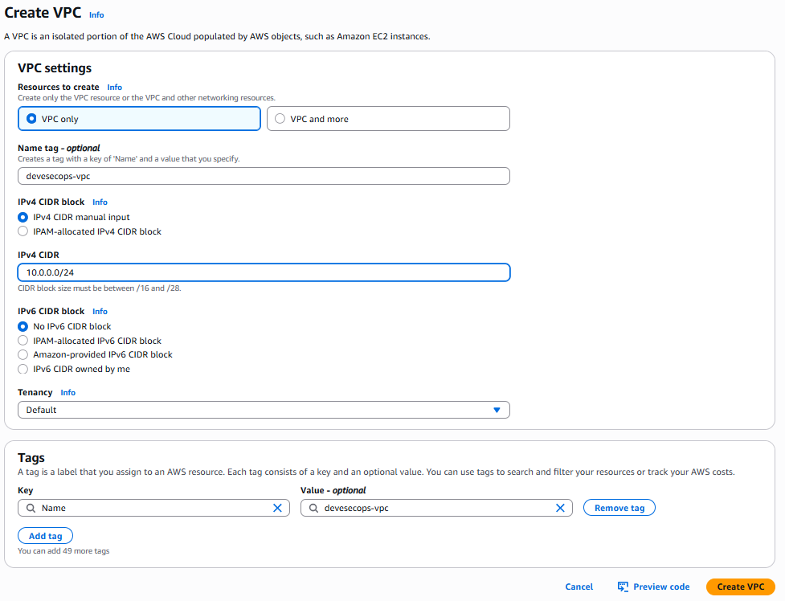

---

## Etapa 2: Criação das Sub-redes

### 2.1 Sub-rede Pública A

- **Name:** `public-subnet-a`  
- **AZ:** `us-east-2a`  
- **CIDR:** `10.0.0.0/26` (64 IPs)  
- **Tag:** `Name = public-subnet-a`

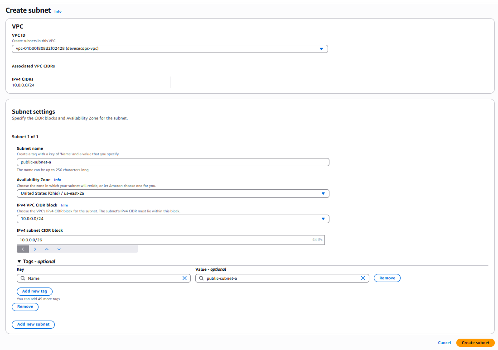

### 2.2 Demais Sub-redes (públicas e privadas)

Todas as quatro sub-redes criadas seguem o mesmo padrão de nomenclatura e bloco CIDR:

- **public-subnet-b:** `10.0.0.64/26`  
- **private-subnet-a:** `10.0.0.128/26`  
- **private-subnet-b:** `10.0.0.192/26`

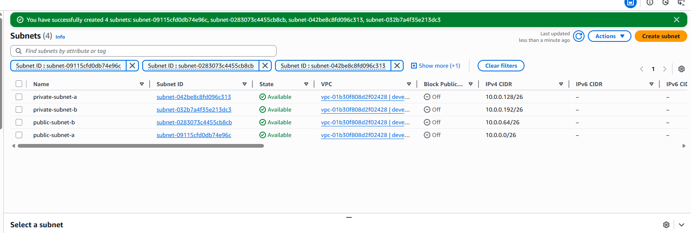

---

## Etapa 3: Internet Gateway & Route Tables

### 3.1 Criar e Anexar Internet Gateway

1. **Create Internet Gateway**  
   - **Name tag:** `devsecops-igw`  
   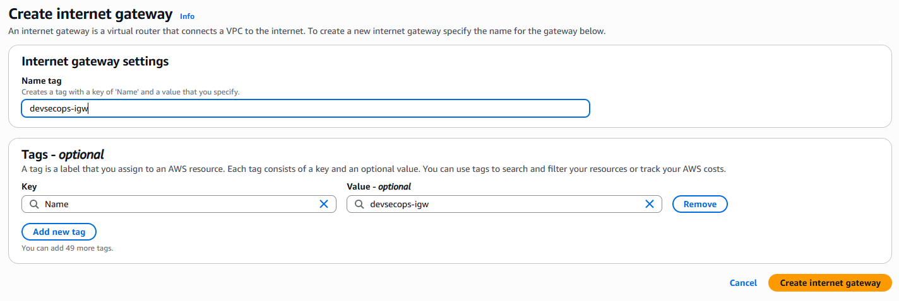

2. **Attach to VPC**  
   - Actions → Attach to VPC → `devsecops-vpc`  
   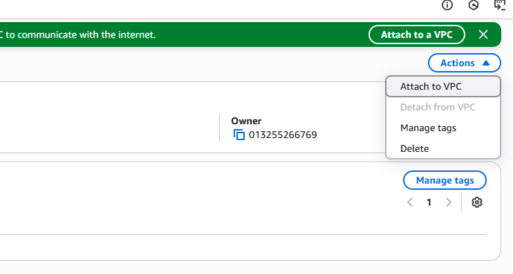

### 3.2 Criar Route Table Pública

1. **Create Route Table**  
   - **Name:** `public-route-table`  
   - **VPC:** `devsecops-vpc`  
   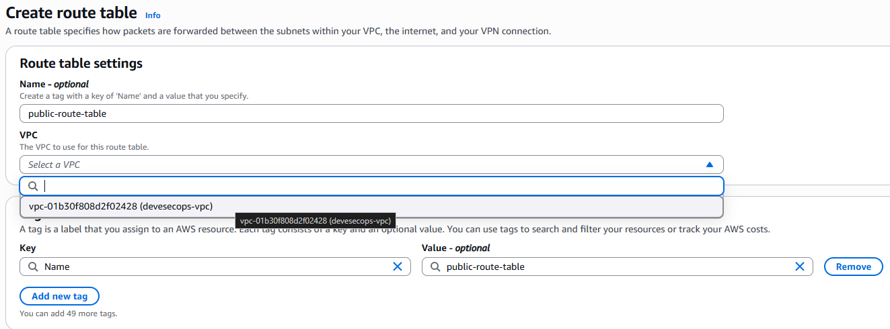

2. **Adicionar rota 0.0.0.0/0 → IGW**  
   - Edit routes → Add route  
     - **Destination:** `0.0.0.0/0`  
     - **Target:** `devsecops-igw`  
   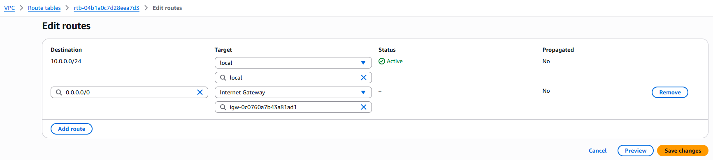

3. **Associar sub-redes públicas**  
   - Edit subnet associations → marcar `public-subnet-a` e `public-subnet-b`  
   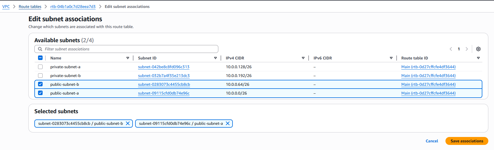

---

## Etapa 4: Instância EC2 com NGINX

### 4.1 Name, Tags e AMI

- **Name:** `PB - JUN - 2025`  
- **CostCenter:** `C092000024`  
- **Project:** `PB - JUN - 2025`  
  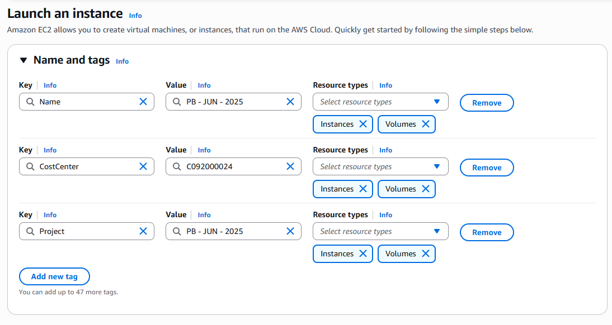

- **AMI:** Amazon Linux 2023  
  - **AMI ID:** `ami-0c803b171269e2d72`  
  - **Username:** `ec2-user`  
  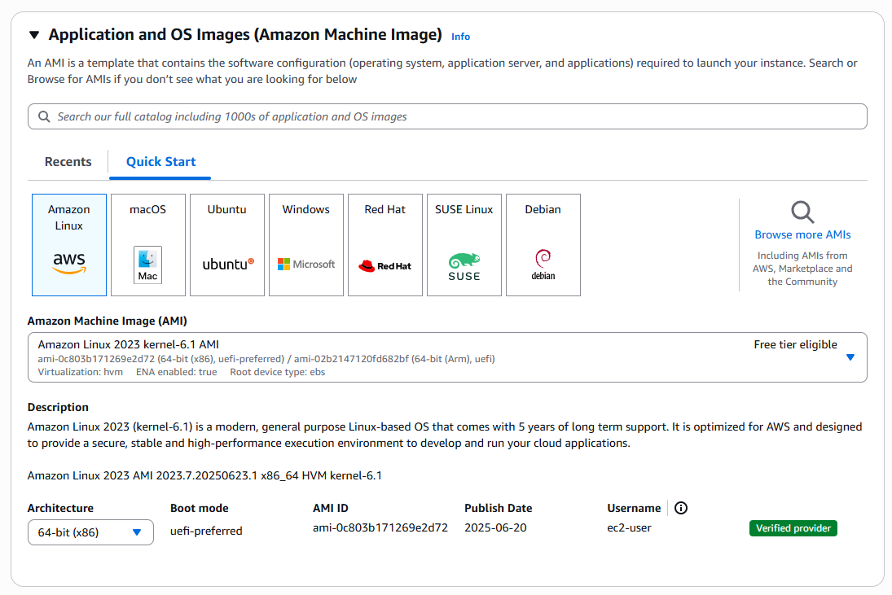

### 4.2 Instance Type & Key Pair

- **Instance type:** `t2.micro` (1 vCPU, 1 GiB – free tier)  
- **Key pair:** `DevSecOps-web-key` (RSA / .pem)  

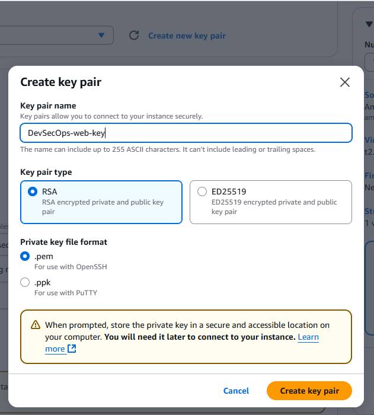  
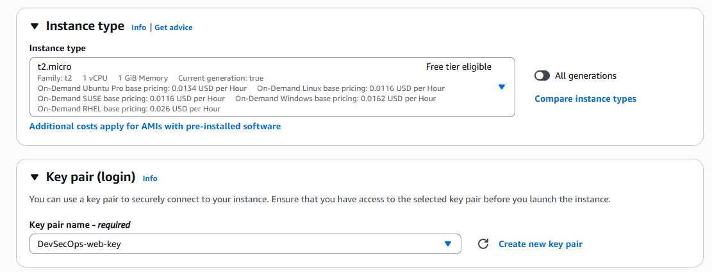

### 4.3 Network settings

- **VPC:** `devsecops-vpc`  
- **Subnet:** `public-subnet-a` (permite IP público)  
- **Auto-assign Public IP:** Enable  
- **Security group:** `devsecops-web-SG`  
  - **SSH (22):** Source = *My IP*  
  - **HTTP (80):** Source = *Anywhere*  

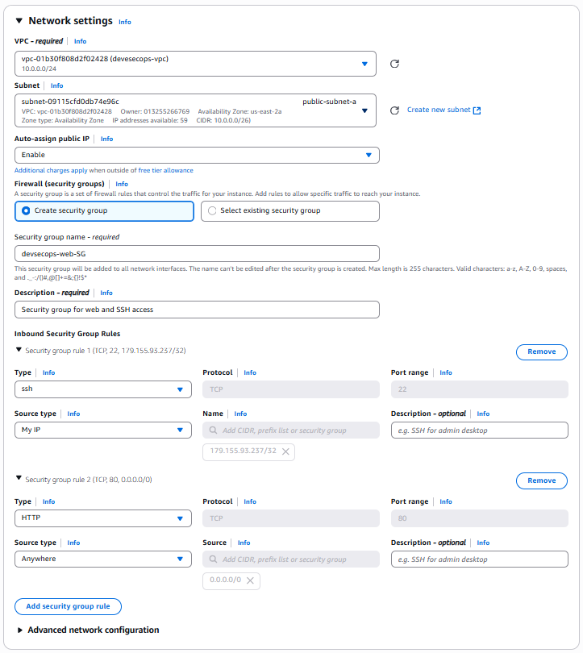

### 4.4 Storage (Volumes)

- **Root volume:** 8 GiB, gp3 (General purpose SSD, 3 000 IOPS)  
- Free tier eligible (até 30 GiB)

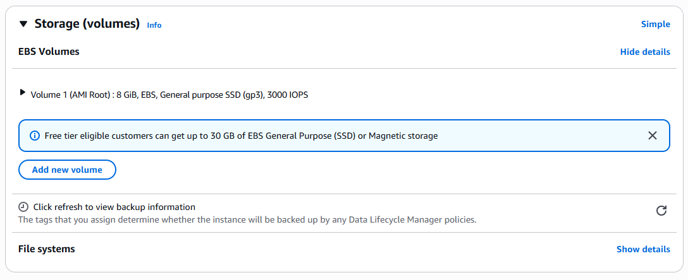

### 4.5 Advanced Details

- **Metadata accessible:** Enabled  
- **Metadata version:** V2 only (token required)  
- **Metadata response hop limit:** 2  

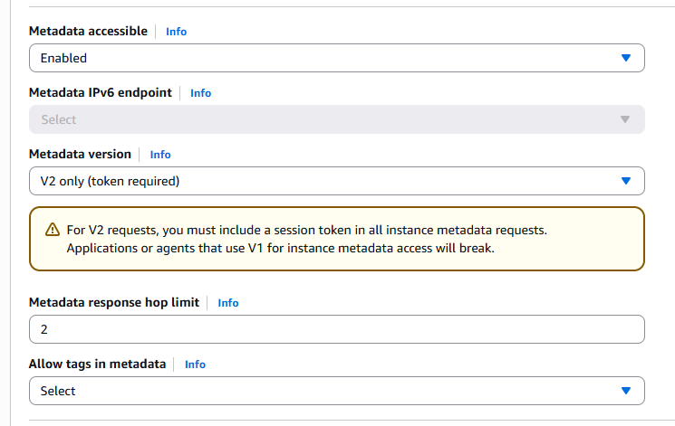

#### User Data (para provisionar NGINX)

```bash
#!/bin/bash
yum update -y
amazon-linux-extras enable nginx1
yum install -y nginx
systemctl enable nginx
systemctl start nginx

echo "<h1>Hello from DevSecOps EC2 with NGINX</h1>" > /usr/share/nginx/html/index.html

## Etapa 1: Criação da VPC

A VPC foi criada manualmente no console AWS utilizando a opção **"VPC only"** para garantir controle total e documentar cada etapa da arquitetura em nuvem. Essa escolha nos permite adicionar manualmente todos os componentes como sub-redes, roteadores e gateways – prática ideal em ambientes educacionais, versionados e com ou sem foco em IaC (*Infrastructure as Code*).

- **CIDR IPv4:** `10.0.0.0/24`  
- **IPv6:** Não utilizado  
- **Tenancy:** Default  
- **Tag:** `Name = devsecops-vpc`  

📸 **Imagem de referência:**  


---

## Etapa 2: Criação das Sub-redes

### 🔹 Sub-rede Pública A

A primeira sub-rede pública foi criada manualmente:

- **Nome:** `public-subnet-a`  
- **Zona de disponibilidade:** `us-east-2a`  
- **Bloco CIDR IPv4:** `10.0.0.0/26` (64 IPs)  
- **Tag:** `Name = public-subnet-a`  

📸 **Imagem de referência:**  


---

### 🔹 Demais sub-redes

Usamos “Add new subnet” para criar em sequência:

- `public-subnet-b` (us-east-2b | 10.0.0.64/26)  
- `private-subnet-a` (us-east-2a | 10.0.0.128/26)  
- `private-subnet-b` (us-east-2b | 10.0.0.192/26)  

📸 **Visão geral das 4 sub-redes:**  


---

## Etapa 3: Internet Gateway & Route Tables

### 🔸 3.1 Criar e anexar Internet Gateway

1. **Create Internet Gateway**  
   - Nome: `devsecops-igw`  
   - 

2. **Attach to VPC**  
   - Selecione `devsecops-igw` → **Actions** → **Attach to VPC** → `devsecops-vpc`  
   - 

---

### 🔸 3.2 Criar Route Table pública

1. **Create Route Table**  
   - Nome: `public-route-table`  
   - VPC: `devsecops-vpc`  
   - 

2. **Adicionar rota 0.0.0.0/0 → IGW**  
   - **Edit routes** → **Add route**  
     - Destination: `0.0.0.0/0`  
     - Target: `devsecops-igw`  
   - 

3. **Associar sub-redes públicas**  
   - **Edit subnet associations** → selecione `public-subnet-a` e `public-subnet-b`  
   - 

---

## Etapa 4: Provisionamento da EC2 com NGINX

### 🔹 4.1 Name and Tags

- **Tags obrigatórias**:

  | Key         | Value           | Resource Types        |
  |-------------|------------------|-----------------------|
  | Name        | PB - JUN - 2025 | Instances, Volumes    |
  | CostCenter  | C092000024      | Instances, Volumes    |
  | Project     | PB - JUN - 2025 | Instances, Volumes    |

📸 **Configuração de Tags:**  


---

### 🔹 4.2 Seleção da AMI

- **AMI:** Amazon Linux 2023 (kernel-6.1, HVM, 64-bit)  
- **AMI ID:** `ami-0c803b171269e2d72`  
- 

---

### 🔹 4.3 Tipo de Instância & Key Pair

- **Instance type:** `t2.micro` (Free Tier)  
- **Key pair:** `DevSecOps-web-key` (RSA/.pem)  
- 

---

### 🔹 4.4 Network Settings & Security Group

- **VPC:** `devsecops-vpc`  
- **Subnet:** `public-subnet-a`  
- **Auto-assign public IP:** Enabled  
- **Security group:** `devsecops-web-SG`  
  - SSH (22) → My IP  
  - HTTP (80) → Anywhere (0.0.0.0/0)  
- 

---

### 🔹 4.5 Configure Storage

- **Root volume (gp3):** 8 GiB, 3 000 IOPS, Delete on Termination  
- 

---

### 🔹 4.6 Advanced Details

#### Metadata
- **Metadata accessible:** Enabled  
- **Metadata version:** V2 only (token required)  
- 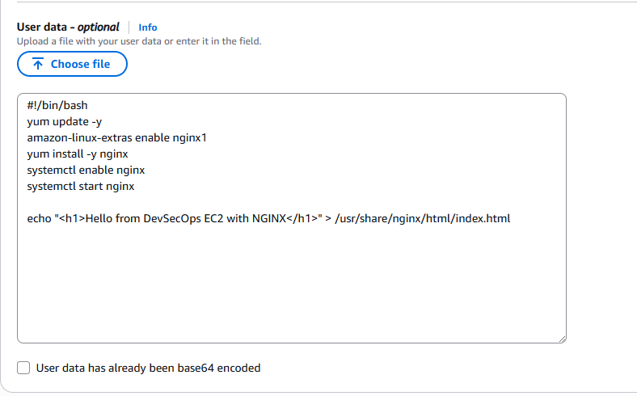

#### User Data
```bash
#!/bin/bash
yum update -y
amazon-linux-extras enable nginx1
yum install -y nginx
systemctl enable nginx
systemctl start nginx
echo "<h1>Hello from DevSecOps EC2 with NGINX</h1>" \
  > /usr/share/nginx/html/index.html

